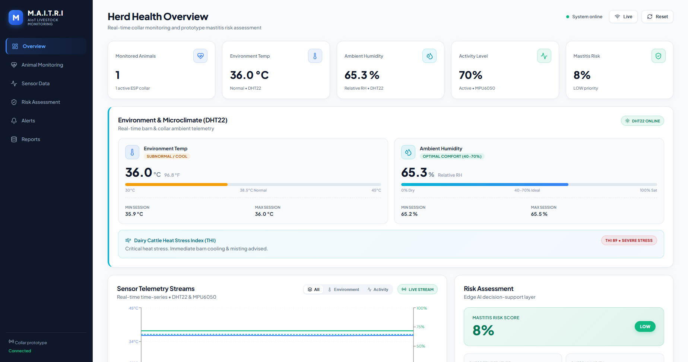
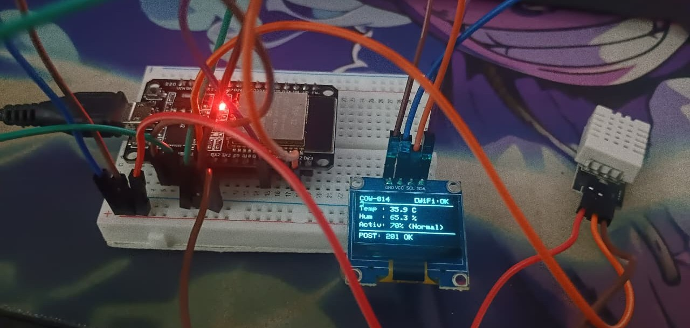

# M.A.I.T.R.I. 🐄🤖

## Mastitis AI-based Tracking & Real-time Inference

> A low-cost, scalable AIoT platform for early bovine mastitis risk
> prediction using real-time animal, milk, environmental, and historical
> data.

## Overview

**M.A.I.T.R.I. (Mastitis AI-based Tracking & Real-time Inference)** is
an AIoT-based livestock health monitoring and decision-support system
designed to identify animals at increased risk of bovine mastitis before
obvious clinical symptoms appear.

The proposed system combines:

-   🐄 **Animal Collar** --- temperature, activity, rumination and other
    physiological/behavioural parameters
-   🥛 **Milk Monitoring Station** --- milk conductivity, pH,
    temperature, yield and SCC data
-   🌡️ **Farm Environment Station** --- temperature, humidity and THI
-   📋 **Historical Records** --- breed, age, lactation stage, previous
    mastitis/disease history, vaccination and treatment records

Collected data is transmitted through **Wi-Fi / LoRa / GSM** to a
backend/cloud platform. After preprocessing and feature engineering,
machine-learning models estimate mastitis risk and can be developed
toward a **7--14 day early-warning forecast** when sufficient
longitudinal data is available.

> **Prototype note:** The current system is a proof-of-concept.
> Prototype risk scores must not be interpreted as a clinical diagnosis.
> Final forecasting requires properly labelled longitudinal data,
> validation, milk/SCC testing and veterinary assessment.

## Problem

Bovine mastitis can reduce milk production and quality, increase
treatment costs, affect animal welfare, and contribute to unnecessary
antimicrobial use. Subclinical mastitis can be particularly difficult to
identify because visible symptoms may be absent.

Traditional monitoring relies heavily on manual observation and periodic
testing.

**Goal:** Move from reactive disease detection to proactive, data-driven
mastitis risk management.

## Proposed Architecture

``` text
                 🐄 DAIRY FARM
                       │
        ┌──────────────┼──────────────┐
        ▼              ▼              ▼
   Animal Collar   Milk Station   Environment
        │              │              │
        └──────────────┼──────────────┘
                       ▼
              Wi-Fi / LoRa / GSM
                       ▼
                ☁️ Backend / Cloud
                       ▼
              Data Preprocessing
                       ▼
              Feature Engineering
                       ▼
                   🧠 ML Model
                       ▼
              Mastitis Risk Score
                       ▼
             Early-Warning Forecast
                       ▼
             📱 Farmer Dashboard
                       ▼
             🩺 Inspection / Action
```

## Key Features

### Animal Monitoring

-   Wearable collar architecture
-   Body-temperature monitoring
-   Activity/movement monitoring
-   Future rumination and physiological sensing

### Milk Monitoring

-   Milk electrical conductivity
-   Milk temperature
-   pH
-   Milk yield/flow
-   Somatic Cell Count (SCC) as an external/periodic input where
    appropriate

### Environment Monitoring

-   Ambient temperature
-   Relative humidity
-   Temperature-Humidity Index (THI)

### AI/ML

Candidate models:

-   Logistic Regression --- baseline
-   Random Forest
-   XGBoost / LightGBM
-   LSTM / GRU for time-series data
-   TinyML-optimized models for edge deployment

### Dashboard

-   Herd overview
-   Individual animal monitoring
-   Sensor telemetry
-   Historical trends
-   Risk classification
-   Alerts and recommendations



## Hardware

### Current Prototype

``` text
ESP32
 ├── DHT22   → Environmental temperature & humidity
 ├── MPU6050 → Activity / movement
 └── OLED    → Local display
        │
        ▼
      Wi-Fi
        │
        ▼
 Backend / Dashboard
```
The DHT22 is used for **environmental monitoring**, not as a validated
animal body-temperature sensor.



### Planned Final Architecture

``` text
🐄 Animal Collar
 ├── ESP32
 ├── Body-temperature sensor
 ├── MPU6050 / IMU
 ├── Optional rumination sensor
 └── Battery + power management

🥛 Milk Station
 ├── ESP32
 ├── Conductivity sensor
 ├── pH sensor
 ├── Milk-temperature sensor
 └── Yield / flow measurement

🌡️ Environment Station
 ├── ESP32
 ├── DHT22 / SHT31 / BME280
 └── Temperature + humidity
```

## Machine Learning Pipeline

``` text
Raw Sensor + Farm Data
          ↓
     Data Cleaning
          ↓
 Missing Value Handling
          ↓
    Outlier Detection
          ↓
  Feature Engineering
          ↓
 Time-Series / Sequence Creation
          ↓
 Train / Validation / Test
          ↓
      ML Training
          ↓
 Model Evaluation
          ↓
 Risk Probability
          ↓
 No / Low / Moderate / High
```

Potential features include temperature trends, activity trends,
rumination changes, milk-yield changes, milk conductivity, SCC, THI,
lactation stage and previous mastitis history.

## Risk Classification

  Risk Level           Prototype Score
  ------------------ -----------------
  🟢 No Risk                    0--20%
  🟡 Low Risk                  20--40%
  🟠 Moderate Risk             40--70%
  🔴 High Risk                70--100%

These are **prototype UI thresholds**, not clinically validated
diagnostic thresholds.

## Technology Stack

  -----------------------------------------------------------------------
  Layer                               Technology
  ----------------------------------- -----------------------------------
  Microcontroller                     ESP32

  Firmware                            Arduino IDE / C++

  Communication                       Wi-Fi / LoRa / GSM

  Backend                             Node.js + Express

  API                                 REST API

  Frontend                            React + Vite

  Visualization                       Recharts

  ML                                  Python, Pandas, NumPy, Scikit-learn

  ML Models                           Random Forest, Logistic Regression,
                                      XGBoost/LightGBM, LSTM/GRU

  Edge AI                             TensorFlow Lite Micro / TinyML

  Version Control                     Git / GitHub
  -----------------------------------------------------------------------

## Repository Structure

``` text
M.A.I.T.R.I/
│
├── hardware/
│   ├── esp32/
│   ├── collar/
│   ├── milk-station/
│   └── environment-station/
│
├── backend/
├── frontend/
├── ml/
│   ├── datasets/
│   ├── preprocessing/
│   ├── training/
│   └── evaluation/
│
├── docs/
│   ├── architecture/
│   ├── diagrams/
│   └── research/
│
└── README.md
```

## Getting Started

### Backend

``` bash
cd backend
npm install
npm run dev
```

Default backend:

``` text
http://localhost:5000
```

### Frontend

``` bash
cd frontend
npm install
npm run dev
```

Default frontend:

``` text
http://localhost:5173
```

### ESP32

1.  Open the firmware in Arduino IDE.
2.  Select the ESP32 board.
3.  Configure Wi-Fi credentials.
4.  Set the backend to the laptop's LAN IP.
5.  Upload the firmware.
6.  Verify readings through Serial Monitor/OLED.
7.  Confirm readings reach the backend.

> The ESP32 should use the laptop's LAN IP rather than `localhost` when
> communicating with a backend hosted on the laptop.

## Backend API

### Health Check

``` http
GET /api/health
```

### Readings

``` http
GET /api/readings
```

### Send Reading

``` http
POST /api/readings
Content-Type: application/json
```

Example:

``` json
{
  "animalId": "COW-014",
  "temperature": 38.7,
  "activity": 72
}
```

### Animal Risk

``` http
GET /api/risk/COW-014
```

## Research & Validation Roadmap

### Phase 1 --- Prototype

-   Sensor integration
-   ESP32 communication
-   Backend
-   Dashboard
-   Demonstration data

### Phase 2 --- Dataset

-   Collect longitudinal animal data
-   Record mastitis labels
-   Integrate milk/SCC measurements
-   Record environmental conditions

### Phase 3 --- Model Development

Compare Logistic Regression, Random Forest, XGBoost/LightGBM and
LSTM/GRU.

### Phase 4 --- Evaluation

Use:

-   Accuracy
-   Precision
-   Recall
-   F1-score
-   ROC-AUC
-   Confusion matrix
-   False-negative rate
-   Prediction-horizon performance

### Phase 5 --- TinyML

Evaluate:

-   Model size
-   RAM usage
-   Flash usage
-   Inference latency
-   Energy consumption

Then optimize an appropriate model for ESP32-class hardware.

### Phase 6 --- Field Validation

Validate across different farms, breeds, climates and herd sizes.

## Innovation

M.A.I.T.R.I. does **not** claim that the smart collar itself is
completely novel. Livestock wearables already exist.

The proposed differentiation is the combination of:

1.  **Mastitis-focused risk prediction**
2.  **Animal + milk + environmental + historical data**
3.  **Low-cost modular architecture**
4.  **Individual-animal risk scoring**
5.  **Targeted early-warning forecasting**
6.  **TinyML-ready edge deployment**
7.  **Farmer and veterinarian decision support**
8.  **Design consideration for Indian smallholder dairy farms**

## Cost Target

  Module                             Estimated Target Cost
  ---------------------------- ---------------------------
  🐄 Smart Collar                  ₹2,000--₹3,500 / animal
  🥛 Milk Station                ₹5,000--₹10,000 / station
  🌡️ Environment Node                ₹1,000--₹2,000 / node
  📡 Gateway / Communication                ₹1,500--₹4,000
  🔋 Power & Enclosure                        ₹500--₹1,000

These are engineering target estimates and can vary with sensor
selection, manufacturing volume, connectivity, calibration and
deployment requirements.

## Limitations

-   High-quality longitudinal mastitis datasets can be difficult to
    obtain.
-   Sensors require calibration and field validation.
-   Similar physiological changes can occur because of other diseases or
    environmental stress.
-   An ML risk score is not a clinical diagnosis.
-   7--14 day forecasting requires appropriate temporal data.
-   Field validation across breeds and farms is necessary.

## Future Scope

-   Multimodal mastitis prediction
-   TinyML inference on the collar
-   LoRa-based large-farm deployment
-   GSM fallback
-   Solar-assisted charging
-   Improved rumination sensing
-   Automated SCC integration
-   Multilingual farmer application
-   Veterinary platform integration
-   Herd-level disease surveillance
-   Continuous model recalibration
-   Expansion to additional livestock health conditions

## Expected Impact

### 🐄 Animal Welfare

Earlier identification of potentially unhealthy animals and timely
intervention.

### 🥛 Milk Production

Reduction of avoidable production losses through earlier action.

### 👨‍🌾 Farmer Economics

Reduced losses and better prioritization of veterinary resources.

### 💊 Antimicrobial Stewardship

Better identification and verification of animals requiring veterinary
attention.

### 🌾 Precision Dairy Farming

Moving from manual/reactive monitoring toward continuous, data-driven
herd management.

## Team

**Team:** The Avengers\
**Project:** M.A.I.T.R.I. --- Mastitis AI-based Tracking & Real-time
Inference\
**Event:** Smart India Hackathon 2026

## Disclaimer

M.A.I.T.R.I. is currently a research/prototype project and is **not a
certified veterinary diagnostic device**.

Sensor abnormalities and ML risk scores should be treated as
decision-support signals. Mastitis diagnosis and treatment should be
confirmed using appropriate veterinary examination and validated
milk-quality/SCC testing.

## Vision

> **Monitor earlier. Predict earlier. Act earlier. Protect the animal.
> Reduce the loss.**

**M.A.I.T.R.I. --- From Early Signs to Early Action.**
